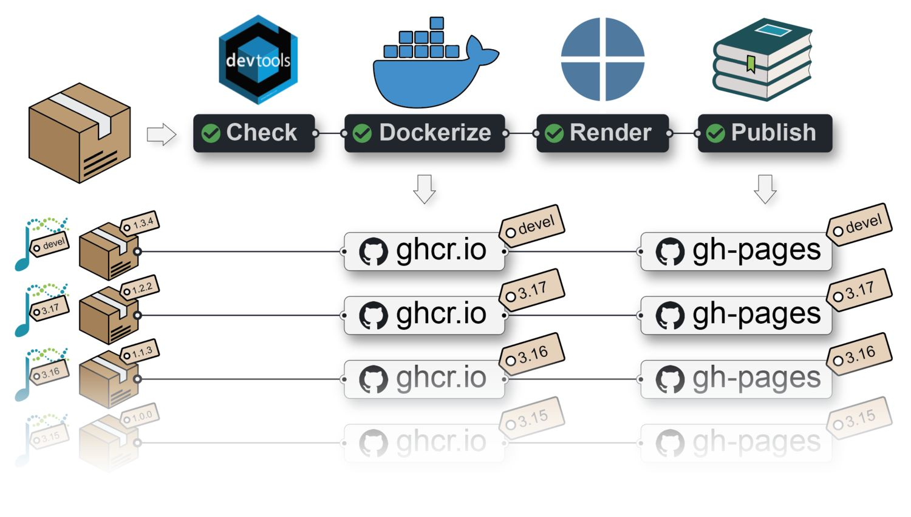

# Write Quarto books with Bioconductor


**Package:** BiocBookDemo\
**Authors:** Jacques Serizay \[aut, cre\]\
**Compiled:** 2026-10-04\
**Package version:** 1.11.4\
**R version:** **R version 4.6.1 (2026-06-24)**\
**BioC version:** **3.24**\
**License:** MIT + file LICENSE\

# What are `BiocBook`s?

`BiocBook`s are **package-based, versioned online books** with a **supporting `Docker` image** for each book version.

A `BiocBook` can be created by authors (e.g. `R` developers, but also scientists, teachers, communicators, …) who wish to:

1.  *Write*: compile a **body of biological and/or bioinformatics knowledge**;
2.  *Containerize*: provide **Docker images** to reproduce the examples illustrated in the compendium;
3.  *Publish*: deploy an **online book** to disseminate the compendium;
4.  *Version*: **automatically** generate specific online book versions and Docker images for specific [Bioconductor releases](https://contributions.bioconductor.org/use-devel.html).

> **TIP:**
>
> A {`BiocBook`}-based package hosted on **GitHub** with a branch named `RELEASE_X_Y` provides:
>
> - A **Docker image**: hosted on [ghcr.io](https://github.com/features/packages);
> - An **online book** (a.k.a website): hosted on the GitHub repository `gh-pages` branch;
>
> Both are built against the specific Bioconductor release `X.Y`.
>
> A {`BiocBook`}-based package submitted to **Bioconductor** also lead to the online book being independently built by the **Bioconductor Build System (BBS)** and deployed to `https://bioconductor.org/books/<bioc_version>/<pkg>/`



# What is this {`BiocBook`} package?

The [{BiocBook} **package**](https://github.com/js2264/BiocBook) offers a streamlined approach to creating `BiocBook`s, with several important benefits:

- The author creates a {`BiocBook`}-based package without leaving R;
- The author writes book chapters in `pages/*.qmd` files using enhanced markdown;
- The author can submit its {`BiocBook`}-based package to Bioconductor.

The containerization and publishing of the new {`BiocBook`}-based package is automated:

- A Github Action workflow **generates different Docker images** for different Bioconductor releases, with the packages used in the book pre-installed;
- A Github Action workflow **publishes different book versions** for different Bioconductor releases.

# Main features of `BiocBook`s

## Fully compatible with the *Bioconductor Build System*

When a {`BiocBook`}-based package is accepted into Bioconductor, it is automatically integrated into the *Bionconductor Build System* (BBS).

This means that it is getting built using `R CMD build --keep-empty-dirs --no-resave-data .`. This triggers the rendering of the book contained in `/inst/`. Book packages built by the BBS are then automatically deployed and are eventually available at `https://bioconductor.org/books/<bioc_version>/<pkg>/`.

## Automated versioning of Docker images

A separate Docker image is built for each branch (named `devel` or `RELEASE_X_Y`) of a {`BiocBook`}-based **Github repository**.

Each Docker image provides pre-installed `R` packages:

- Bioconductor release `X.Y`;
- Specific book dependencies from Bioconductor release `X.Y` (listed in `DESCRIPTION`);
- The book package itself

The Docker images also include a `python` environment, named `BiocBook`, in which all the packages listed in `requirements.yml` are installed, and which `reticulate` picks up automatically in any `R` session started from the image (see [sec-python](#sec-python)).

For example, `Docker` images built from the {`BiocBookDemo`} package repository are available here:

👉 [ghcr.io/js2264/biocbookdemo](https://ghcr.io/js2264/biocbookdemo) 🐳

> **TIP:**
>
> You can get access to all the packages used in this book in \< 1 minute, using this command in a terminal:
>
> ``` sh
> docker run -it ghcr.io/js2264/biocbookdemo:devel R
> ```

## Automated versioning of the online book

Regardless of whether the book package is submitted to Bioconductor, a Github Actions workflow publishes individual online books for each branch (named `devel` or `RELEASE_X_Y`) of a `BiocBook`-based **Github repository**.

For example, the online book version matching the `devel` version of the {`BiocBook`} package is available from:

👉 <http://js2264.github.io/BiocBookDemo/devel/> 📘

## RStudio Server

An RStudio Server instance based on a specific Bioconductor `<version>` (`devel` or `RELEASE_X_Y`) can be initiated from the corresponding `Docker` image as follows:

``` sh
docker run \
    --volume <local_folder>:<destination_folder> \
    -e PASSWORD=OHCA \
    -p 8787:8787 \
    ghcr.io/<github_user>/<biocbook_repo>:<version>
```

The initiated RStudio Server instance will be available at <https://localhost:8787>.

Further instructions regarding Bioconductor-based Docker images are available [here](https://bioconductor.org/help/docker/).

# Acknowledgments

This works was inspired by and closely follows the strategy used in coordination by the Bioconductor core team and Aaron Lun to submit book-containing packages (from the `OSCA` series as well as `SingleR` and `csaw` books).

- *Orchestrating Single-Cell Analysis with Bioconductor* ([n.d.](#ref-OSCA))
- *Assigning cell types with SingleR* ([2023](#ref-SingleR))
- *The csaw Book* ([2023](#ref-csaw))

This package was also inspired by the `*down` package series, including:

- Xie ([2014](#ref-knitr))
- Xie ([2016](#ref-bookdown))
- Wickham et al. ([2022](#ref-pkgdown))

# Session info

> **NOTE:**
>
> ``` r
> sessioninfo::session_info(
>     installed.packages()[,"Package"], 
>     include_base = TRUE
> )
> ##  ─ Session info ────────────────────────────────────────────────────────────
> ##   setting  value
> ##   version  R version 4.6.1 (2026-06-24)
> ##   os       Ubuntu 24.04.4 LTS
> ##   system   x86_64, linux-gnu
> ##   ui       X11
> ##   language (EN)
> ##   collate  C
> ##   ctype    en_US.UTF-8
> ##   tz       Etc/UTC
> ##   date     2026-10-04
> ##   pandoc   3.11 @ /usr/bin/ (via rmarkdown)
> ##   quarto   1.11.5 @ /usr/local/bin/quarto
> ##  
> ##  ─ Packages ────────────────────────────────────────────────────────────────
> ##   package        * version date (UTC) lib source
> ##   askpass          1.2.1   2024-10-04 [2] RSPM (R 4.6.0)
> ##   base           * 4.6.1   2026-09-11 [3] local
> ##   base64enc        0.1-6   2026-02-02 [2] RSPM (R 4.6.0)
> ##   BiocBook         1.11.3  2026-10-04 [2] Github (js2264/BiocBook@9f32ed4)
> ##   BiocBookDemo     1.11.4  2026-10-04 [1] local
> ##   BiocGenerics     0.59.12 2026-08-11 [2] Bioconductor 3.24 (R 4.6.1)
> ##   BiocManager      1.30.27 2025-11-14 [2] CRAN (R 4.6.1)
> ##   BiocStyle        2.41.0  2026-04-28 [2] Bioconductor 3.24 (R 4.6.1)
> ##   BiocVersion      3.24.0  2026-04-28 [2] Bioconductor 3.24 (R 4.6.1)
> ##   bookdown         0.48    2026-08-28 [2] RSPM (R 4.6.0)
> ##   boot             1.3-32  2025-08-29 [3] CRAN (R 4.6.1)
> ##   brew             1.0-10  2023-12-16 [2] RSPM (R 4.6.0)
> ##   brio             1.1.5   2024-04-24 [2] RSPM (R 4.6.0)
> ##   bslib            0.12.0  2026-08-04 [2] RSPM (R 4.6.0)
> ##   cachem           1.1.0   2024-05-16 [2] RSPM (R 4.6.0)
> ##   callr            3.8.0   2026-06-05 [2] RSPM (R 4.6.0)
> ##   class            7.3-24  2026-08-03 [2] RSPM (R 4.6.0)
> ##   cli              3.6.6   2026-04-09 [2] RSPM (R 4.6.0)
> ##   clipr            0.8.1   2026-05-25 [2] RSPM (R 4.6.0)
> ##   cluster          2.1.8.3 2026-07-30 [2] RSPM (R 4.6.0)
> ##   codetools        0.2-20  2024-03-31 [3] CRAN (R 4.6.1)
> ##   commonmark       2.0.0   2025-07-07 [2] RSPM (R 4.6.0)
> ##   compiler         4.6.1   2026-09-11 [3] local
> ##   cpp11            0.5.5   2026-05-06 [2] RSPM (R 4.6.0)
> ##   crayon           1.5.3   2024-06-20 [2] RSPM (R 4.6.0)
> ##   credentials      2.0.3   2025-09-12 [2] RSPM (R 4.6.0)
> ##   curl             8.0.0   2026-08-25 [2] RSPM (R 4.6.0)
> ##   datasets       * 4.6.1   2026-09-11 [3] local
> ##   desc             1.4.3   2023-12-10 [2] RSPM (R 4.6.0)
> ##   devtools         2.5.2   2026-04-30 [2] RSPM (R 4.6.0)
> ##   diffobj          0.3.9   2026-09-11 [2] RSPM (R 4.6.0)
> ##   digest           0.6.39  2025-11-19 [2] RSPM (R 4.6.0)
> ##   docopt           0.7.2   2025-03-25 [2] RSPM (R 4.6.1)
> ##   downlit          0.4.5   2025-11-14 [2] RSPM (R 4.6.0)
> ##   dplyr            1.2.1   2026-04-03 [2] RSPM (R 4.6.0)
> ##   ellipsis         0.3.3   2026-04-04 [2] RSPM (R 4.6.0)
> ##   evaluate         1.0.5   2025-08-27 [2] RSPM (R 4.6.0)
> ##   fansi            1.0.7   2025-11-19 [2] RSPM (R 4.6.0)
> ##   fastmap          1.2.0   2024-05-15 [2] RSPM (R 4.6.0)
> ##   fontawesome      0.5.3   2024-11-16 [2] RSPM (R 4.6.0)
> ##   foreign          0.8-91  2026-01-29 [3] CRAN (R 4.6.1)
> ##   fs               2.1.0   2026-04-18 [2] RSPM (R 4.6.0)
> ##   generics         0.1.4   2025-05-09 [2] RSPM (R 4.6.0)
> ##   gert             2.4.1   2026-08-19 [2] RSPM (R 4.6.0)
> ##   gh               1.6.1   2026-07-20 [2] RSPM (R 4.6.0)
> ##   gitcreds         0.1.2   2022-09-08 [2] RSPM (R 4.6.0)
> ##   glue             1.8.1   2026-04-17 [2] RSPM (R 4.6.0)
> ##   graphics       * 4.6.1   2026-09-11 [3] local
> ##   grDevices      * 4.6.1   2026-09-11 [3] local
> ##   grid             4.6.1   2026-09-11 [3] local
> ##   here             1.0.2   2025-09-15 [2] RSPM (R 4.6.0)
> ##   highr            0.12    2026-03-06 [2] RSPM (R 4.6.0)
> ##   htmltools        0.5.9   2025-12-04 [2] RSPM (R 4.6.0)
> ##   htmlwidgets      1.6.4   2023-12-06 [2] RSPM (R 4.6.0)
> ##   httpuv           1.6.17  2026-03-18 [2] RSPM (R 4.6.0)
> ##   httr             1.4.9   2026-09-01 [2] RSPM (R 4.6.0)
> ##   httr2            1.3.0   2026-07-13 [2] RSPM (R 4.6.0)
> ##   ini              0.3.1   2018-05-20 [2] RSPM (R 4.6.0)
> ##   jquerylib        0.1.4   2021-04-26 [2] RSPM (R 4.6.0)
> ##   jsonlite         2.0.0   2025-03-27 [2] RSPM (R 4.6.0)
> ##   KernSmooth       2.23-27 2026-08-12 [2] RSPM (R 4.6.0)
> ##   knitr            1.52    2026-09-06 [2] RSPM (R 4.6.0)
> ##   later            1.4.8   2026-03-05 [2] RSPM (R 4.6.0)
> ##   lattice          0.23-1  2026-08-12 [2] RSPM (R 4.6.0)
> ##   lifecycle        1.0.5   2026-01-08 [2] RSPM (R 4.6.0)
> ##   littler          0.3.23  2026-04-12 [2] RSPM (R 4.6.1)
> ##   magrittr         2.0.5   2026-04-04 [2] RSPM (R 4.6.0)
> ##   MASS             7.3-66  2026-07-15 [2] RSPM (R 4.6.0)
> ##   Matrix           1.7-6   2026-07-25 [2] RSPM (R 4.6.0)
> ##   memoise          2.0.1   2021-11-26 [2] RSPM (R 4.6.0)
> ##   methods        * 4.6.1   2026-09-11 [3] local
> ##   mgcv             1.9-4   2025-11-07 [3] CRAN (R 4.6.1)
> ##   mime             0.13    2025-03-17 [2] RSPM (R 4.6.0)
> ##   miniUI           0.1.2   2025-04-17 [2] RSPM (R 4.6.0)
> ##   nlme             3.1-171 2026-09-01 [2] RSPM (R 4.6.0)
> ##   nnet             7.3-21  2026-08-03 [2] RSPM (R 4.6.0)
> ##   openssl          2.4.2   2026-06-09 [2] RSPM (R 4.6.0)
> ##   otel             0.2.0   2025-08-29 [2] RSPM (R 4.6.0)
> ##   pak              0.11.1  2026-07-22 [2] RSPM (R 4.6.0)
> ##   parallel         4.6.1   2026-09-11 [3] local
> ##   pillar           1.11.1  2025-09-17 [2] RSPM (R 4.6.0)
> ##   pkgbuild         1.4.8   2025-05-26 [2] RSPM (R 4.6.0)
> ##   pkgconfig        2.0.3   2019-09-22 [2] RSPM (R 4.6.0)
> ##   pkgdown          2.2.1   2026-07-07 [2] RSPM (R 4.6.0)
> ##   pkgload          1.5.3   2026-06-15 [2] RSPM (R 4.6.0)
> ##   png              0.1-9   2026-03-15 [2] RSPM (R 4.6.0)
> ##   praise           1.0.0   2015-08-11 [2] RSPM (R 4.6.0)
> ##   preprocessCore   1.75.1  2026-08-31 [2] Bioconductor 3.24 (R 4.6.1)
> ##   prettyunits      1.2.0   2023-09-24 [2] RSPM (R 4.6.0)
> ##   processx         3.9.0   2026-04-22 [2] RSPM (R 4.6.0)
> ##   profvis          0.4.0   2024-09-20 [2] RSPM (R 4.6.0)
> ##   promises         1.5.0   2025-11-01 [2] RSPM (R 4.6.0)
> ##   ps               1.9.3   2026-04-20 [2] RSPM (R 4.6.0)
> ##   purrr            1.2.2   2026-04-10 [2] RSPM (R 4.6.0)
> ##   quarto           1.5.1   2025-09-04 [2] RSPM (R 4.6.0)
> ##   R6               2.6.1   2025-02-15 [2] RSPM (R 4.6.0)
> ##   ragg             1.5.2   2026-03-23 [2] RSPM (R 4.6.0)
> ##   rappdirs         0.3.4   2026-01-17 [2] RSPM (R 4.6.0)
> ##   rcmdcheck        1.4.0   2021-09-27 [2] RSPM (R 4.6.0)
> ##   Rcpp             1.1.2   2026-07-05 [2] RSPM (R 4.6.0)
> ##   RcppTOML         0.2.3   2025-03-08 [2] RSPM (R 4.6.0)
> ##   rdtools          0.1.0   2026-07-16 [2] RSPM (R 4.6.0)
> ##   remotes          2.5.0   2024-03-17 [2] RSPM (R 4.6.0)
> ##   renv             1.3.0   2026-09-29 [2] RSPM (R 4.6.0)
> ##   reticulate       1.47.0  2026-09-03 [2] RSPM (R 4.6.0)
> ##   rlang            1.3.0   2026-07-05 [2] RSPM (R 4.6.0)
> ##   rmarkdown        2.32    2026-09-01 [2] RSPM (R 4.6.0)
> ##   roxygen2         8.1.0   2026-08-04 [2] RSPM (R 4.6.0)
> ##   rpart            4.1.27  2026-03-27 [3] CRAN (R 4.6.1)
> ##   rprojroot        2.1.1   2025-08-26 [2] RSPM (R 4.6.0)
> ##   rstudioapi       0.19.0  2026-06-11 [2] RSPM (R 4.6.0)
> ##   rversions        3.0.0   2025-10-09 [2] RSPM (R 4.6.0)
> ##   sass             0.4.10  2025-04-11 [2] RSPM (R 4.6.0)
> ##   sessioninfo      1.2.4   2026-06-04 [2] RSPM (R 4.6.0)
> ##   shiny            1.14.0  2026-06-21 [2] RSPM (R 4.6.0)
> ##   sourcetools      0.1.7-2 2026-03-28 [2] RSPM (R 4.6.0)
> ##   spatial          7.3-19  2026-08-03 [2] RSPM (R 4.6.0)
> ##   splines          4.6.1   2026-09-11 [3] local
> ##   stats          * 4.6.1   2026-09-11 [3] local
> ##   stats4           4.6.1   2026-09-11 [3] local
> ##   stringi          1.8.9   2026-08-04 [2] RSPM (R 4.6.0)
> ##   stringr          1.6.0   2025-11-04 [2] RSPM (R 4.6.0)
> ##   survival         3.8-12  2026-09-09 [2] RSPM (R 4.6.0)
> ##   sys              3.4.3   2024-10-04 [2] RSPM (R 4.6.0)
> ##   systemfonts      1.3.2   2026-03-05 [2] RSPM (R 4.6.0)
> ##   tcltk            4.6.1   2026-09-11 [3] local
> ##   testthat         3.3.2   2026-01-11 [2] RSPM (R 4.6.0)
> ##   textshaping      1.0.5   2026-03-06 [2] RSPM (R 4.6.0)
> ##   tibble           3.3.1   2026-01-11 [2] RSPM (R 4.6.0)
> ##   tidyselect       1.2.1   2024-03-11 [2] RSPM (R 4.6.0)
> ##   tinytex          0.61    2026-09-17 [2] RSPM (R 4.6.0)
> ##   tools            4.6.1   2026-09-11 [3] local
> ##   urlchecker       2.0.0   2026-07-08 [2] RSPM (R 4.6.0)
> ##   usethis          3.2.2   2026-09-10 [2] RSPM (R 4.6.0)
> ##   utf8             1.2.6   2025-06-08 [2] RSPM (R 4.6.0)
> ##   utils          * 4.6.1   2026-09-11 [3] local
> ##   vctrs            0.7.3   2026-04-11 [2] RSPM (R 4.6.0)
> ##   waldo            0.6.2   2025-07-11 [2] RSPM (R 4.6.0)
> ##   whisker          0.4.1   2022-12-05 [2] RSPM (R 4.6.0)
> ##   withr            3.0.3   2026-06-19 [2] RSPM (R 4.6.0)
> ##   xfun             0.61    2026-09-16 [2] RSPM (R 4.6.0)
> ##   xml2             1.6.0   2026-06-22 [2] RSPM (R 4.6.0)
> ##   xopen            1.0.1   2024-04-25 [2] RSPM (R 4.6.0)
> ##   xtable           1.8-8   2026-02-22 [2] RSPM (R 4.6.0)
> ##   yaml             2.3.12  2025-12-10 [2] RSPM (R 4.6.0)
> ##   zip              3.0.2   2026-08-04 [2] RSPM (R 4.6.0)
> ##  
> ##   [1] /tmp/RtmpASCh25/Rinstb7e21def1
> ##   [2] /usr/local/lib/R/site-library
> ##   [3] /usr/local/lib/R/library
> ##   * ── Packages attached to the search path.
> ##  
> ##  ─ Python configuration ────────────────────────────────────────────────────
> ##   Python is not available
> ##  
> ##  ───────────────────────────────────────────────────────────────────────────
> ```

# References

*Assigning cell types with SingleR*. 2023. <https://bioconductor.org/books/3.17/SingleRBook>.

*Orchestrating Single-Cell Analysis with Bioconductor*. n.d. <https://bioconductor.org/books/devel/OSCA>.

*The csaw Book*. 2023. <https://bioconductor.org/books/devel/csawBook>.

Wickham, Hadley, Jay Hesselberth, and Maëlle Salmon. 2022. *Pkgdown: Make Static HTML Documentation for a Package*. <https://CRAN.R-project.org/package=pkgdown>.

Xie, Yihui. 2014. “Knitr: A Comprehensive Tool for Reproducible Research in R.” In *Implementing Reproducible Computational Research*, edited by Victoria Stodden, Friedrich Leisch, and Roger D. Peng. Chapman; Hall/CRC.

Xie, Yihui. 2016. *Bookdown: Authoring Books and Technical Documents with R Markdown*. Chapman; Hall/CRC. <https://bookdown.org/yihui/bookdown>.
