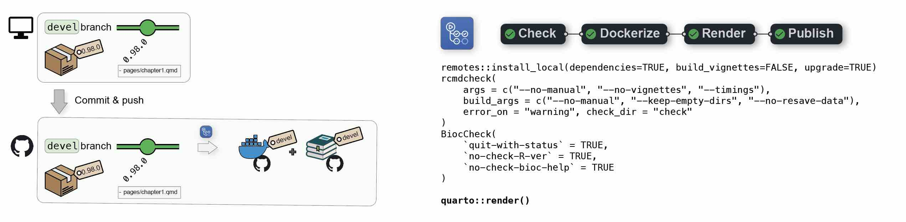
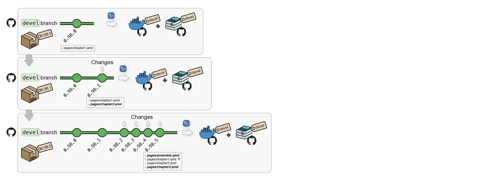
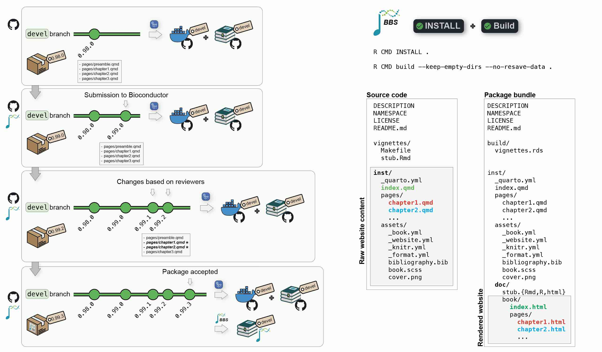
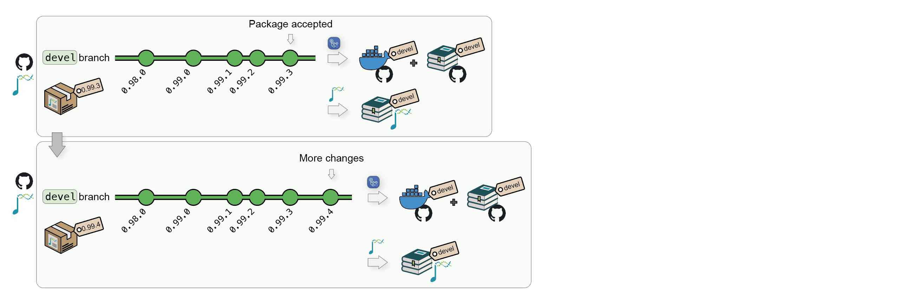
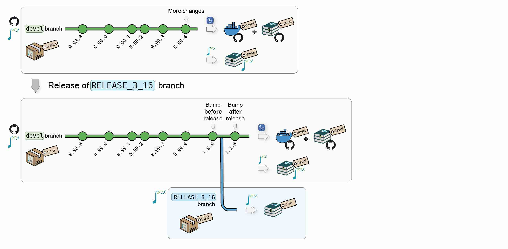
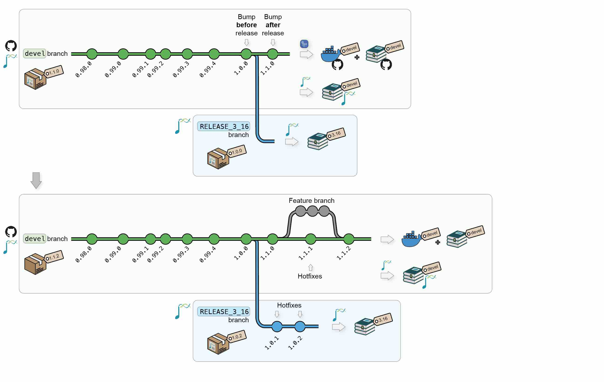
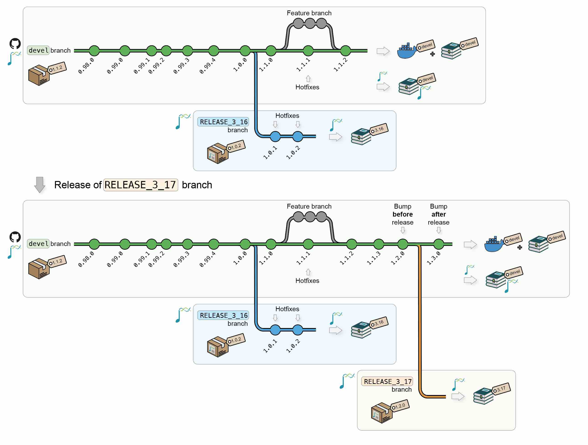

# 1  `BiocBook` versioning system

> **WARNING:**
>
> - Any **package** built using the {`BiocBook`} package is itself a {`BiocBook`}-based package;
> - As such, it follows the release schedule from `Bioconducor`;
> - The `pages/` folder contains a number of pages which are rendered as a **website** using Quarto;
> - The **name** of the branch (`devel` or `RELEASE_X_Y`) is ***crucial***, as it is used to select a Bioconductor version to 1) build a **Docker image** for the {`BiocBook`}-based package and 2) render the `BiocBook` **website**.

## 1.1 Continuous Integration and Continuous Delivery

### 1.1.1 From local to Github

When pushing a {`BiocBook`}-based **package** from a local `devel` branch to Github, (e.g. when writing new articles), two jobs are automatically triggered from a single Github Actions workflow:

1.  First, a **Docker image** will be created to build the {`BiocBook`} package against the Bioconductor `devel` branch and push the resulting image to `ghcr.io/<github_user>/<package_name>:devel`;
2.  Then, this image will be used to render the `BiocBook` **website** and deploy it to `https://<github_user>.github.io/<package_name>/devel/`



Additional commits on the `devel` branch will trigger regeneration of the `devel` Docker image and the online book `devel` version.



### 1.1.2 Package submission to Bioconductor

Submission to Biconductor can follow the [same reviewing process](https://contributions.bioconductor.org/bioconductor-package-submissions.html#whattoexpect) as other standard packages.

1.  The author submits a book package to `Bioconductor/Contributions`;
2.  Once review starts, the package gets tested by Bioconductor’s [*Single Package Builder*](https://github.com/Bioconductor/packagebuilder) (*SPB*);
3.  The author pushes changes to its Github repository; this will update the `devel` Docker image and the online book `devel` version;
4.  Regularly, the author bumps versions and push to Bioconductor’s `upstream` branch to trigger a new *SPB* test run;
5.  Once the *SPB* returns no error/warnings, the package may be accepted;
6.  When a book package is accepted, it starts being regularly built by the [*Bioconductor Build System*](https://github.com/Bioconductor/BBS) (*BBS*).
7.  The *BBS* build automatically renders the book and deploys it online.



At all time, the author’s local `devel` branch should be synchronized with its Github remote `origin` as well as the Bioconductor `upstream` remote.

- Any commit pushed to the remote Github `origin` remote will trigger a new Github Actions workflow and regenerate the `devel` Docker image and the online book **served by Github**.
- Any commit pushed to the remote Bioconductor `upstream` remote will result in a new build by the **BBS** and an update of the **Bioconductor’s hosted book**.



### 1.1.3 New Bioconductor releases

When Bioconductor releases a version `X.Y`, the core team will automatically create a new `upstream:<package_name>@RELEASE_X_Y`. This will automatically trigger new builds of the **Bioconductor’s hosted book** against the new release.

When this occurs, the `upstream` branch can also be pulled to `origin:<package_name>@RELEASE_X_Y` to:

1.  Create a **Docker image** @ `ghcr.io/<github_user>/<package_name>:RELEASE_X_Y`, with the book **package** installed using Bioconductor `X.Y`;
2.  Publish the book **website** to `https://<github_user>.github.io/<package_name>/X.Y/`, using packages from Bioconductor `X.Y`.



> **NOTE:**
>
> A {`BiocBook`}-based **package** can follow its own release life cycle if the autor does not intend to submit it to Bioconductor.
>
> If the author of a {`BiocBook`}-based **package** intends to submit this package/book/website to Bioconductor, the [Bioconductor submission and release life cycle](https://contributions.bioconductor.org/versionnum.html):
>
> - When developing a {`BiocBook`}-based **package** (at the submission and during review), the **package** version should be between `0.99.0` and `1.0.0`.
> - Once the submission is accepted and Bioconductor releases a new version `X.Y`, the {`BiocBook`}-based **package** version will automatically be bumped to `1.0.0` in Bioconductor release `X.Y` and to `1.1.0` in the continuing Bioconductor `devel`.

### 1.1.4 Updates

After new releases, updates and/or hot fixes can still made, both on the latest Bioconductor release and on the `devel` branch. New commits will automatically trigger the regeneration of the Docker image and the online book for the modified branch(es).



Additional Bioconductor releases will generate new versions of the Docker image and of the online book.



## 1.2 Access to versioned Docker and online book

### 1.2.1 Docker images versioning

The different versions of a `BiocBook` **Docker image** are availabed at the following URL:

`ghcr.io/<github_user>/<package_name>`

For example, for this package ({`BiocBookDemo`}), the following **Docker image** versions are available:

- [ghcr.io/js2264/biocbookdemo:devel](https://github.com/js2264?tab=packages&repo_name=BiocBookDemo)
- [ghcr.io/js2264/biocbookdemo:3.17](https://github.com/js2264?tab=packages&repo_name=BiocBookDemo)
- [ghcr.io/js2264/biocbookdemo:3.16](https://github.com/js2264?tab=packages&repo_name=BiocBookDemo)
- [ghcr.io/js2264/biocbookdemo:3.15](https://github.com/js2264?tab=packages&repo_name=BiocBookDemo)

### 1.2.2 Website versioning

The different versions of a `BiocBook` **website** are hosted at the following URL:

`https://<github_user>.github.io/<package_name>/<version>`

For example, for this package ({`BiocBookDemo`}), the following **website** versions are available:

- <https://js2264.github.io/BiocBookDemo/devel/>
- <https://js2264.github.io/BiocBookDemo/3.17/>
- <https://js2264.github.io/BiocBookDemo/3.16/>
- <https://js2264.github.io/BiocBookDemo/3.15/>

## 1.3 Does this really work?

The `BIOCONDUCTOR_DOCKER_VERSION` variable is set in all `Bioconductor` Docker images. For instance, this version of the `BiocBookDemo` package online book relies on:

``` r
Sys.getenv("BIOCONDUCTOR_DOCKER_VERSION")
##  [1] "3.24.18"
```

> **TIP:**
>
> Note that this variable will always match the `X.Y` version returned by `BiocVersion` used to render the online book.
>
> ``` r
> packageVersion("BiocVersion")
> ##  [1] '3.24.0'
> ```

## 1.4 So what packages can I use?

Any package that has been released in the Bioconductor version you are using (in this book version, this is 3.24.0).

The `BiocBaseUtils` package is available in Bioconductor since `3.16`, while the `BiocHail` package was only made available in `3.17`. `CuratedAtlasQueryR` has recently been accepted in `3.18` (current `devel`, on Mon Oct 5 11:35:17 2026). Let’s check this!

``` r
packageVersion("BiocVersion")
##  [1] '3.24.0'
BiocManager::available("BiocBaseUtils")
##  [1] "BiocBaseUtils"
BiocManager::available("BiocHail")
##  [1] "BiocHail"
BiocManager::available("CuratedAtlasQueryR")
##  character(0)
```

## 1.5 Session info

``` r
sessioninfo::session_info()
##  ─ Session info ────────────────────────────────────────────────────────────
##   setting  value
##   version  R version 4.6.1 (2026-06-24)
##   os       Ubuntu 24.04.4 LTS
##   system   x86_64, linux-gnu
##   ui       X11
##   language (EN)
##   collate  C
##   ctype    en_US.UTF-8
##   tz       Etc/UTC
##   date     2026-10-05
##   pandoc   3.11 @ /usr/bin/ (via rmarkdown)
##   quarto   1.11.5 @ /usr/local/bin/quarto
##  
##  ─ Packages ────────────────────────────────────────────────────────────────
##   package     * version date (UTC) lib source
##   BiocManager   1.30.27 2025-11-14 [2] CRAN (R 4.6.1)
##   cli           3.6.6   2026-04-09 [2] RSPM (R 4.6.0)
##   digest        0.6.39  2025-11-19 [2] RSPM (R 4.6.0)
##   evaluate      1.0.5   2025-08-27 [2] RSPM (R 4.6.0)
##   fastmap       1.2.0   2024-05-15 [2] RSPM (R 4.6.0)
##   htmltools     0.5.9   2025-12-04 [2] RSPM (R 4.6.0)
##   htmlwidgets   1.6.4   2023-12-06 [2] RSPM (R 4.6.0)
##   jsonlite      2.0.0   2025-03-27 [2] RSPM (R 4.6.0)
##   knitr         1.52    2026-09-06 [2] RSPM (R 4.6.0)
##   otel          0.2.0   2025-08-29 [2] RSPM (R 4.6.0)
##   rlang         1.3.0   2026-07-05 [2] RSPM (R 4.6.0)
##   rmarkdown     2.32    2026-09-01 [2] RSPM (R 4.6.0)
##   sessioninfo   1.2.4   2026-06-04 [2] RSPM (R 4.6.0)
##   xfun          0.61    2026-09-16 [2] RSPM (R 4.6.0)
##  
##   [1] /tmp/RtmpcGMBFb/Rinstb771d3bef
##   [2] /usr/local/lib/R/site-library
##   [3] /usr/local/lib/R/library
##  
##  ───────────────────────────────────────────────────────────────────────────
```
