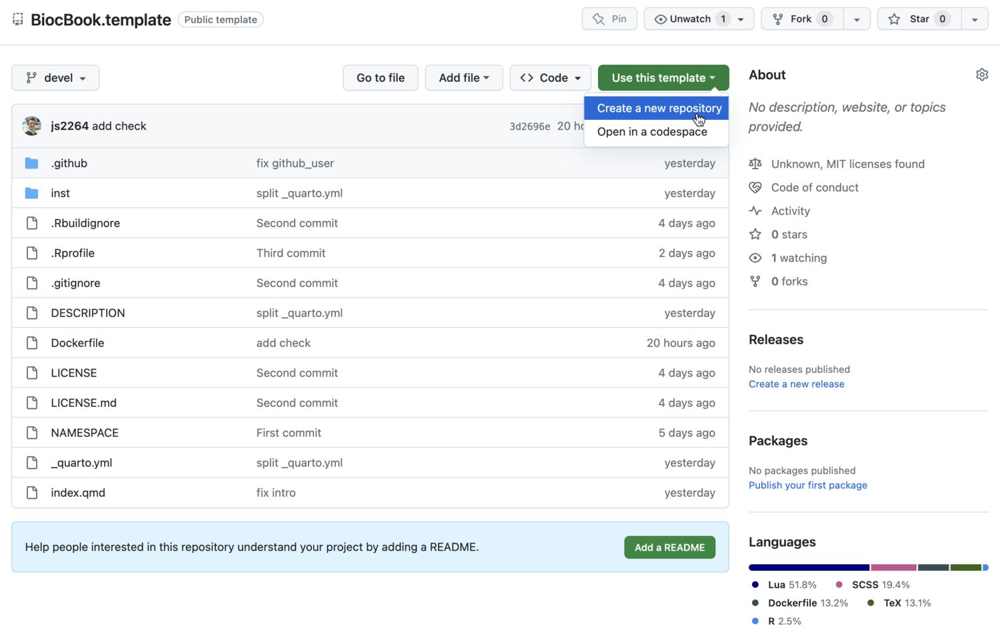
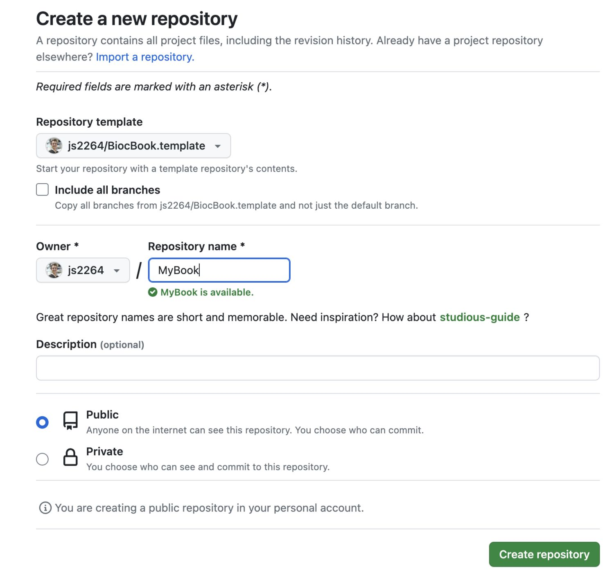
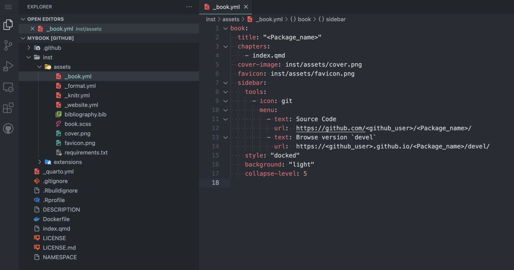
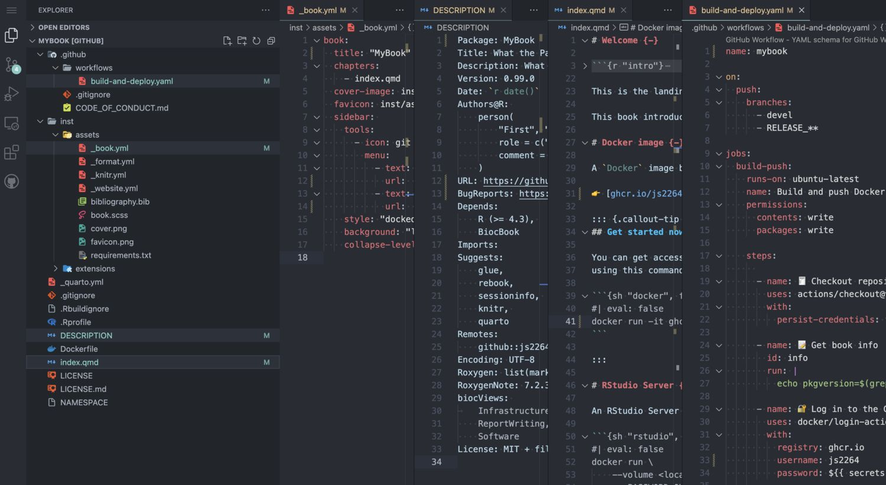
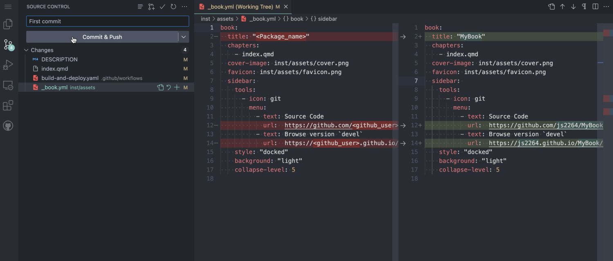

# 2  Writing a {`BiocBook`} package

## 2.1 Register a Github account in R

> **TIP:**
>
> Skip this section if your Github account is already registered. You can check this by typing:
>
> ``` r
> gh::gh_whoami()
> ```

### 2.1.1 Creating a new Github token

``` r
usethis::create_github_token(
    description = "BiocBook", 
    scopes = c("repo", "user:email", "workflow")
)
```

This command will open up a new web browser. On the displayed Github page:

- Select an Expiration date;
- Make sure that at least `repo`, `user > user:email` and `workflow` scopes are selected;
- Click on “Generate token” at the bottom of the page;
- Copy your Github token displayed in the Github web page

### 2.1.2 Register your new token in R

``` r
gitcreds::gitcreds_set()
```

Paste your new Github token here and press “Enter”.

> **TIP:**
>
> On Linux, `gitcreds` is generally not able to permanently store the provided Github token. For this reason, you may want to also add your Github token to `~/.Renviron` to be able to reuse it. You can edit the `~/.Renviron` by typing [`usethis::edit_r_environ()`](https://usethis.r-lib.org/reference/edit.html), and define the `GITHUB_PAT` environment variable:
>
> ``` txt
> GITHUB_PAT="<YOUR-TOKEN>"
> ```

### 2.1.3 Double check you are logged in

``` r
gh::gh_whoami()
```

## 2.2 `BiocBook` workflow

### 2.2.1 Initiate a {`BiocBook`} package

#### 2.2.1.1 R

Creating a `BiocBook` in `R` is straightforward with the {`BiocBook`} package.

``` r
if (!require("BiocManager", quietly = TRUE)) install.packages("BiocManager")
if (!require("BiocBook", quietly = TRUE)) BiocManager::install("BiocBook")
library(BiocBook)
biocbook <- init("myBook")
```

The steps performed under the hood by [`init()`](https://rdrr.io/pkg/BiocBook/man/BiocBook.html) are detailed in the console. Briefly, the following steps are followed:

1.  Creating a local git repository using the `BiocBook` package template
2.  Fillout placeholders from the template
3.  Push local commits to your Github account, creating a new GitHub repository

#### 2.2.1.2 VS Code

> **WARNING:**

##### Use the {`BiocBook.template`} package template

This template can be cloned from [`js2264/BiocBook.template`](https://github.com/js2264/BiocBook.template)



##### Create a new repo



##### 2.2.1.2.1 Enable `Github Pages` to be deployed

You will need to enable the Github Pages service for your newly created repository.

- Go to your new `Github` repository;
- Open the “Settings” tab;
- On the leftside bar, clik on the “Pages” tab;
- Select the `gh-pages` branch and the `/docs` folder to deploy your Github Pages.


##### Enter VS Code editor by pressing `.`



##### Fillout placeholders

> **WARNING:**
>
> Three types of placeholders need to be replaced:
>
> 1.  `<Package_name>`
> 2.  `<package_name>`
> 3.  `<github_user>`
>
> Three different files contain these placeholders:
>
> 1.  `/inst/assets/_book.yml`
> 2.  `/DESCRIPTION`
> 3.  `/index.qmd`



##### Commit changes



##### Clone the package to a local computer

### 2.2.2 Starting from an existing `bookdown` book

An existing `bookdown` book can be turned into a `BiocBook` with [`from_bookdown()`](https://rdrr.io/pkg/BiocBook/man/BiocBook-bookdown.html), in its own repository. Run it at the root of the repository, on a branch of its own: it converts the book in place, one commit per step, so that the conversion can be reviewed step by step, and squashed or rebased like any other change.

``` r
## At the root of the repository of the bookdown book, on a new branch
biocbook <- from_bookdown()
```

- **Template**: the package files of a `BiocBook` (`DESCRIPTION`, `Dockerfile`, GitHub workflows, `quarto` configuration) are added, filled in as [`init()`](https://rdrr.io/pkg/BiocBook/man/BiocBook.html) does;
- **Pages**: `index.Rmd` becomes the landing page and every chapter a `.qmd` page in `inst/pages/`, moved as they are so that git follows them, and listed in `_book.yml` in the same order, with its parts and appendices;
- **Syntax**: `bookdown` cross-references (`\@ref()`), figure layout options and the question/solution blocks of [`msmbstyle`](https://github.com/lgatto/msmbstyle) are rewritten for `quarto`;
- **Assets** (bibliography, CSS, images) move next to the pages, the `bookdown` build (`_bookdown.yml`, the rendered book…) is removed, and `DESCRIPTION` gets the title, authors and licence of the book and the packages its pages use;
- **Shared session**: `bookdown` renders every chapter in a single `R` session, `quarto` renders each in its own, so the [`library()`](https://rdrr.io/r/base/library.html) and [`options()`](https://rdrr.io/r/base/options.html) calls of `index.Rmd` are repeated at the top of each chapter.

What still needs a human is listed in `MIGRATION.md`, at the root of the book, which is not committed: downloads while the book builds, cached chunks, unresolved cross-references, dependencies that are not on CRAN or Bioconductor, objects created in a chapter and used in a later one, files that are not part of a `BiocBook`…

### 2.2.3 Edit new `BiocBook` chapters

- `add_chapter(biocbook, title)` is used to write new chapters;
- `add_preamble(biocbook)` is used to add an unnumbered extra page after the Welcome page but before the chapters begin.

> **WARNING:**
>
> This ensures that these packages are installed in the Docker image prior to rendering.

### 2.2.4 Edit assets

A BiocBook relies on several assets, located in `/inst/assets`.:

- `_book.yml`, `_format.yml`, `_knitr.yml`, `_website.yml`
- `bibliography.bib`
- `book.scss`

To quickly edit these assets, use the corresponding `edit_*` functions:

``` r
edit_yml(biocbook)
edit_bib(biocbook)
edit_css(biocbook)
```

### 2.2.5 Previewing and publishing changes

#### 2.2.5.1 Previewing

While writing, you can monitor the rendering of your book live as follows:

``` r
preview(biocbook)
```

This will serve a local live rendering of your book.

#### 2.2.5.2 Publishing

Once you are done writing pages of your new book, you should always commit your changes and push them to Github. This can be done as follows:

``` r
publish(biocbook, message = "🚀 Publish")
```

#### 2.2.5.3 Check your published book and Dockerfiles

This connects to the Github repository associated with a local book and checks the existing branches and Dockerfiles.

``` r
status(biocbook)
```

## 2.3 Writing features

### 2.3.1 Executing code

It’s super easy to execute actual code from any `BiocBook` page when rendering the `BiocBook` website.

#### 2.3.1.1 `R` code

`R` code can be executed and rendered:

``` r
utils::packageVersion("BiocVersion")
##  [1] '3.24.0'
```

#### 2.3.1.2 `bash` code

`bash` code can also be executed and rendered:

``` sh
find ../ -name "*.qmd"
##  ../index.qmd
##  ../pages/biocbook-vs-rebook.qmd
##  ../pages/Chapter-4.qmd
##  ../pages/Chapter-2.qmd
##  ../pages/Chapter-1.qmd
##  ../pages/preamble.qmd
##  ../pages/Chapter-3.qmd
```

#### 2.3.1.3 `python` code

`python` code can also be executed and rendered:

``` python
import os
os.getcwd()
```

`python` needs a little more care than `R` or `bash`, because the book is also re-rendered by the Bioconductor Build System, which provides no `python` packages. A book therefore installs its own: the packages are declared as a `conda` environment in `inst/requirements.yml` and installed at build time by [`BiocBook::setup_python()`](https://rdrr.io/pkg/BiocBook/man/BiocBook-python.html).

See [the chapter on executing `python` code](Chapter-4.llms.md) for the full story.

### 2.3.2 Creating data object

While writing chapters, you can save objects as `.rds` files to reuse them in subsequent chapters (e.g. [here](biocbook-vs-rebook.llms.md#rebook-features-missing-from-biocbook)).

``` r
isthisworking <- "yes"
saveRDS(isthisworking, 'isthisworking.rds')
```

### 2.3.3 Adding references

References can be listed as `.bib` entries in the bibliography file located in `inst/assets/bibliography.bib`. The references can be added in-line using the @ notation, e.g. by typing **@serizay2023**, this will insert the following reference: **Serizay ([2023](#ref-serizay2023))**.

## 2.4 Session info

``` r
sessioninfo::session_info()
##  ─ Session info ────────────────────────────────────────────────────────────
##   setting  value
##   version  R version 4.6.1 (2026-06-24)
##   os       Ubuntu 24.04.4 LTS
##   system   x86_64, linux-gnu
##   ui       X11
##   language (EN)
##   collate  C
##   ctype    en_US.UTF-8
##   tz       Etc/UTC
##   date     2026-10-05
##   pandoc   3.11 @ /usr/bin/ (via rmarkdown)
##   quarto   1.11.5 @ /usr/local/bin/quarto
##  
##  ─ Packages ────────────────────────────────────────────────────────────────
##   package     * version date (UTC) lib source
##   cli           3.6.6   2026-04-09 [2] RSPM (R 4.6.0)
##   digest        0.6.39  2025-11-19 [2] RSPM (R 4.6.0)
##   evaluate      1.0.5   2025-08-27 [2] RSPM (R 4.6.0)
##   fastmap       1.2.0   2024-05-15 [2] RSPM (R 4.6.0)
##   htmltools     0.5.9   2025-12-04 [2] RSPM (R 4.6.0)
##   htmlwidgets   1.6.4   2023-12-06 [2] RSPM (R 4.6.0)
##   jsonlite      2.0.0   2025-03-27 [2] RSPM (R 4.6.0)
##   knitr         1.52    2026-09-06 [2] RSPM (R 4.6.0)
##   lattice       0.23-1  2026-08-12 [2] RSPM (R 4.6.0)
##   Matrix        1.7-6   2026-07-25 [2] RSPM (R 4.6.0)
##   otel          0.2.0   2025-08-29 [2] RSPM (R 4.6.0)
##   png           0.1-9   2026-03-15 [2] RSPM (R 4.6.0)
##   Rcpp          1.1.2   2026-07-05 [2] RSPM (R 4.6.0)
##   reticulate    1.47.0  2026-09-03 [2] RSPM (R 4.6.0)
##   rlang         1.3.0   2026-07-05 [2] RSPM (R 4.6.0)
##   rmarkdown     2.32    2026-09-01 [2] RSPM (R 4.6.0)
##   sessioninfo   1.2.4   2026-06-04 [2] RSPM (R 4.6.0)
##   xfun          0.61    2026-09-16 [2] RSPM (R 4.6.0)
##   yaml          2.3.12  2025-12-10 [2] RSPM (R 4.6.0)
##  
##   [1] /tmp/RtmpcGMBFb/Rinstb771d3bef
##   [2] /usr/local/lib/R/site-library
##   [3] /usr/local/lib/R/library
##  
##  ───────────────────────────────────────────────────────────────────────────
```

Serizay, Jacques. 2023. *BiocBook: Write, Publish and Maintain Versioned Quarto Books with Bioconductor*. <https://github.com/js2264/BiocBook>.
